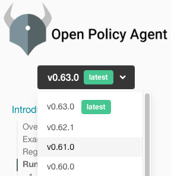

TODO:  THIS STUFF ABOUT INTERACTIVE DOESN"T SEEM TO BELONG ON THIS PAGE.  MOVE TO EXECUTION?
IS THIS STILL TRUE?

# Module Import

ScubaGear can be invoked interactively or non-interactively once it has the [permissions](../docs/permissions/required_permissions.md) necessary to execute the tool in either mode. 

TODO: WHICH IS THE DEFAULT MODE?

* The **interactive mode** prompts the user for credentials via Microsoft's popup windows. 
* The **non-interactive mode** uses an Azure AD application service principal and thus enables the tool to be used as part of automations, such as pipelines and scheduled jobs. 

The [execation page](execution.md) provides examples for running in both modes.

TODO:  WILL IT REALLY BE ADDED, OR SHOULD WE DROP THIS PROMISE?

> **NOTE**: Only PowerShell 5.1 is currently supported. PowerShell 7 may work, but has not been tested. Full PowerShell 7 support will be added in a future release.

IS THIS IMPORTED STATEMENT STILL TRUE?

Before ScubaGear can be executed, it must be imported into every new PowerShell terminal session.  To import the module, navigate to the repository folder in a PowerShell 5.1 terminal and run:

TODO: VERIFY THAT THESE ARE ALL CORRECT:

```powershell
# Imports the module into your session
Import-Module -Name .\PowerShell\ScubaGear 
```

If you receive a warning that _The required supporting PowerShell modules are not installed_, run the following cmdlet:

```powershell
# Installs the minimum required dependencies
Initialize-SCuBA 
```

> **IMPORTANT**: `Initialize-SCuBA` installs OPA.  TODO: SO WHAT?  WHY IS THIS SO IMPORTANT?

TODO: AND WHAT ABOUT IF I ONLY IMPORT MODULE?  DOES THAT INSTALL OPA TOO?  WHY WOULD I NEED TO RUN THIS CMDLET?

The `Install-OPA` cmdlet can be run by itself to download the executable:

```powershell
# Downloads OPA
Install-OPA ANYTHING ELSE HERE?
```

In the event of an unsuccessful download, users can manually download the OPA executable with the following steps:

* Go to [OPA download site](https://www.openpolicyagent.org/docs/latest/#running-opa).
* In the upper left corner, select the version of OPA that is compatible with ScubaGear, cururrently v0.61.0.

  

* Using the navigation menu on the left side, click `Introduction`, then `Running OPA`, and then `Download OPA`.
* Find where it says, "Windows users can obtain the OPA executable from here" and click the link in "here" to download the exe.

TODO: WHAT IS THIS DIR?

* Locate the downloaded exe and move it to WHERE? (default is ~\\.scubagear\Tools)

To verify that OPA is working, use the following command to check the version:

```powershell
# Check the OPA version
.\opa_windows_amd64.exe version
```